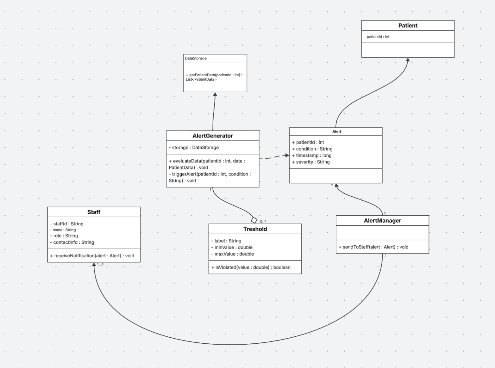
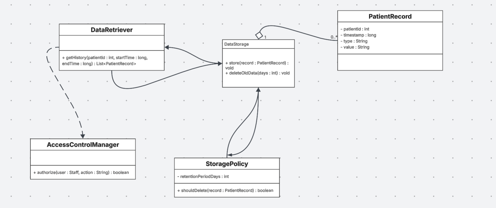
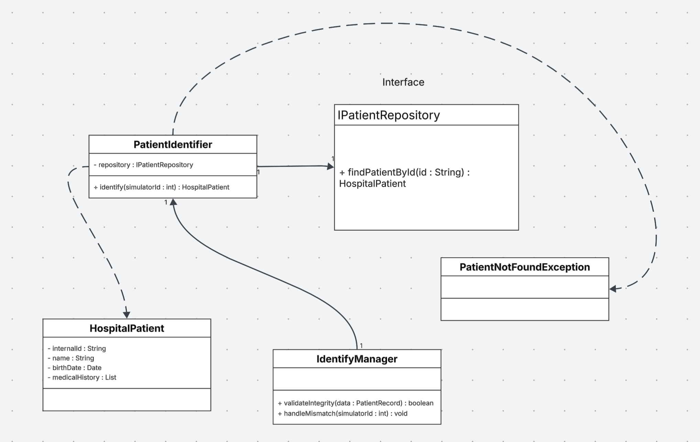
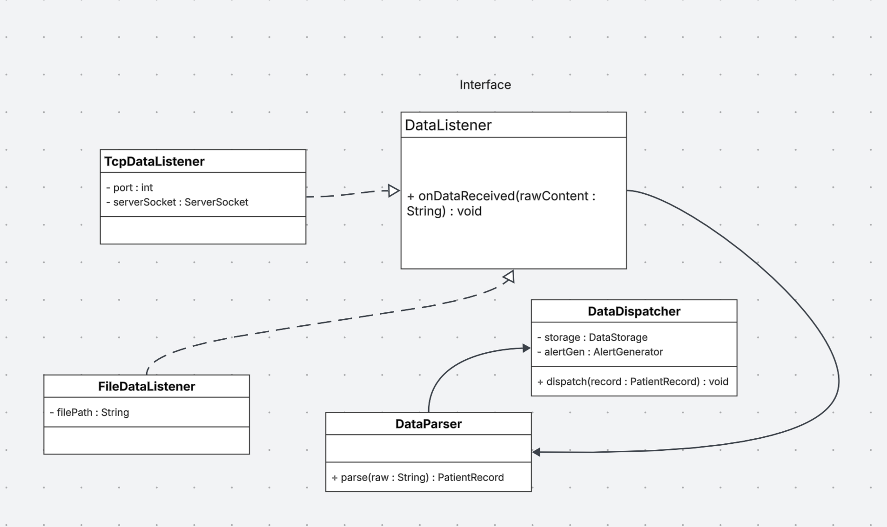

## 1. Alert Generation System

* Why Ibuilt it this way:
This system is all about keeping an eye on patient vitals in real-time and shouting for help when things go bad.
I used an AlertGenerator class to handle the heavy lifting and a Threshold class to prevent when it goes above.
When a vital sign hits a red zone, an Alert object gets created with all the deets (time, severity, patient ID).
I kept the detection (AlertGenerator) and the notification (AlertManager) separate so that we can update one without the other.
Finally, linking it to Staff ensures the right person gets pinged at the right time.*
---

## 2. Data Storage System

* Handling medical data is serious business—you need it to be safe and you need to keep it organized. 
I built this around a DataStorage interface. By using an interface, the rest of the app doesn't care what were saving. 
Every piece of info is wrapped in a PatientRecord, which keeps things tidy with timestamps for history tracking.
the StoragePolicy is the "clean-up crew"—it handles the retention rules, like deleting old data after 30 days so the servers don't get swamped. 
On the security side, I added an AccessControlManager. 
It acts like a bouncer; before anyone can pull data through the DataRetriever, they have to prove they’ve got the clearance. 
It’s all about keeping that patient privacy on lock.*

## 3. Patient Identification System

* In a hospital, you cannot mix up patients. 
This system takes the raw IDs from the sensors (which are usually just numbers) and matches them with actual hospital files. 
I used an IPatientRepository interface here. 
This is great for modularity: whether the patient list is in a local file or a massive hospital database, 
the PatientIdentifier works exactly the same way.
The IdentifyManager is the boss of this process.
If a sensor sends data for an ID that doesn't exist in our records, the system throws a PatientNotFoundException.
I designed it this way because "silent errors" are dangerous in healthcare—it’s better to flag a mismatch immediately
than to save data to the wrong person. Once everything clears, we get a HospitalPatient object with the name, birthdate,
and medical history ready to go.*

## 4. Data Access Layer

* This layer is the "front door" of the app. 
It’s designed to keep the messy details of the outside world (like TCP connections or raw files) away from the clean logic of our system. 
I used the Strategy Pattern with a DataListener interface. 
This means we can swap between a TcpDataListener and a FileDataListener on the fly. 
If we want to add Bluetooth or WebSockets later? Easy, we just plug in a new listener.
The flow is super straight: the listener grabs the raw text, hands it to the DataParser to turn it into a clean PatientRecord object, 
and then the DataDispatcher sends it where it needs to go. 
By separating the "receiving," "parsing," and "sending," the code stays clean and way easier to test. 
It’s basically a high-speed conveyor belt for patient data.*

